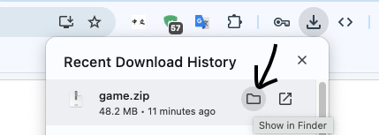

# How to Use The App

## IMPORTANT: This app only runs on MacOS, it will not work on Windows

## Starting the App
- Go to "Releases" section (right side, below description)
- Click on the lastest release (has a green "lastest" indicator)
- Download the .zip file by clicking on it
- Click "show in Finder" (Note: you can also right-click the .zip file and skip the next step but this might not work 100% of the time)

Note: Your computer might automatically unzip the file and if so, skip the next step

- Right-click the .zip file and click "Open"
  - Archive Utility should start unzipping it
  - After it's done, a .app file should appear next to the .zip
- Delete the .zip as its no longer needed
- Right-click the .app and click "Open"
- If an warning message shows saying that the file may contain malware, **Do not press the blue "Move to trash" button**.
  - Instead, close the popup and go to Launchpad
    - There should be a launchpad button in your menu bar (the bar with your apps at the bottom of your screen) that looks like 
      - Search for and click on the Terminal App
    - If the launchpalaud button is missing from your menu bar, go to finder and search for **"Terminal"**
      - Open the Terminal App
  - Navigate to your app using the cd command and enter the following command to "quarantine" the app, basically telling the computer that the app is safe to open: **xattr -dr com.apple.quarantine game.app**
    - The cd command for the downloads folder is: **cd ~/Downloads**
    - IF YOU MOVED THE APP TO SOMEWHERE BESIDES THE DOWNLOADS FOLDER, please go to https://www.google.com/search?q=how+to+use+the+cd+command+in+terminal+on+mac to learn how to use the cd command
### Example:

- Then, double-click or right-click + "Open" to open the app
- The app will take up to a minute for it to load (loading time depends on the computer)
- After it loads, the app should start up and see the controls section below for instructions

---

## Controls

### Pause / Resume
- **Space** — Pause or resume the game/the presents

### Falling Speed
- **↑ Up Arrow** — Increase falling speed  
- **↓ Down Arrow** — Decrease falling speed

### Music
- **S** — Toggle te background music on/off

---

## Word Menu

### Open / Close
- **Right-click anywhere** to open the word menu
- **Right-click anywhere that's not on a word** to close it

Opening the menu automatically pauses the game.
(If the game was paused before opening the menu, after closing the menu you need to resume the game a second time with spacebar.

---

## Adding Words
1. Right-click to open the menu
2. Type to add words in the input box at the top
3. Use left or right arrow keys to move the cursor ( | ) and use **Backspace** or **Delete** to delete words/characters
4. Press **Enter** to add the word

### Input Box Supports...
- **Chinese characters** and **pinyin** (no accents (ní hǎo); sorry!)
- **Copy / Paste**
  - Copy: **⌘ + C**
  - Paste: **⌘ + V**

---

## Removing Words
- **Right-click directly on a word** in the menu to delete it  
- At least one word must remain or the game will crash (There is code in the app to stop the deletion of the last word, but it might not work)

---

## Scrolling the Word List
- Use the **mouse wheel** or any other way you usually scroll pages to scroll up and down the list of words if it goes off the menu
- Scrolling has momentum and stops at the top/bottom

---

## Window
- The window is **resizable**
- You can fullscreen it or manually adjust the size by hovering your mouse over the edges of the window and dragging
- The background and layout adjust automatically

---

## Notes
- Changes to the word list apply immediately
- The changes will NOT save if the app gets closed
- Deleted words are deleted forever - restart the app to regain deleted items
- Closing the menu resumes the game automatically (if it was paused by the menu)
- Email me (kasper.jk.liu@gmail.com) for questions and suggestions!
